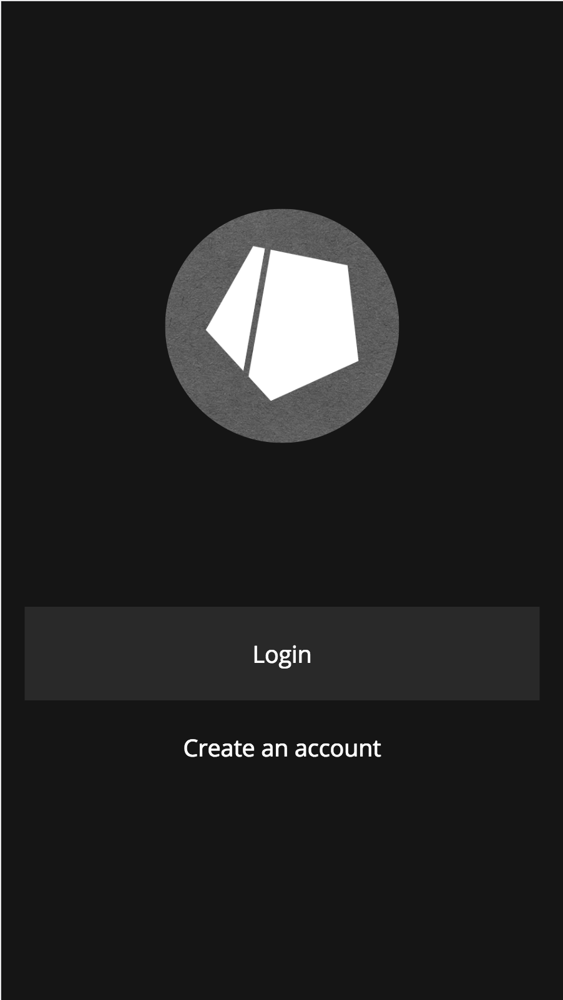
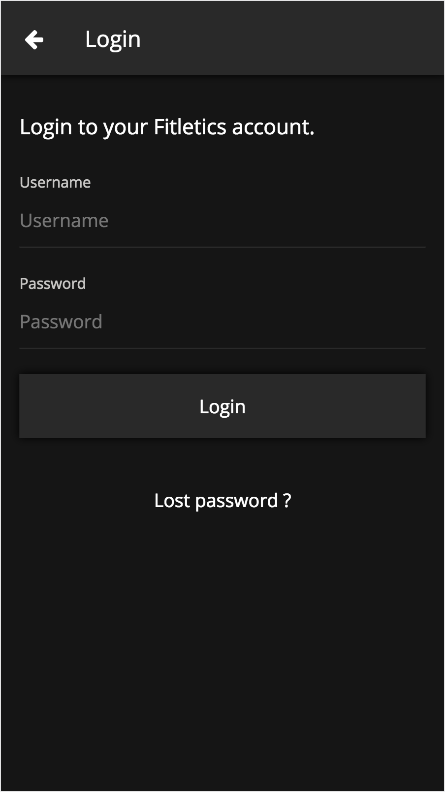
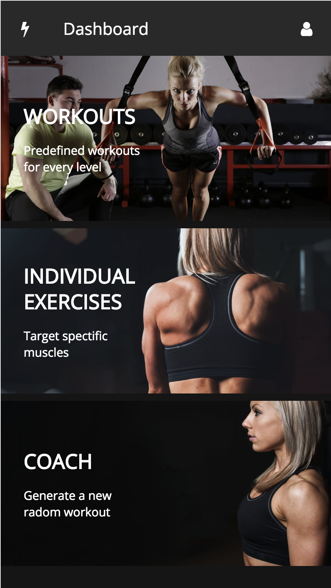
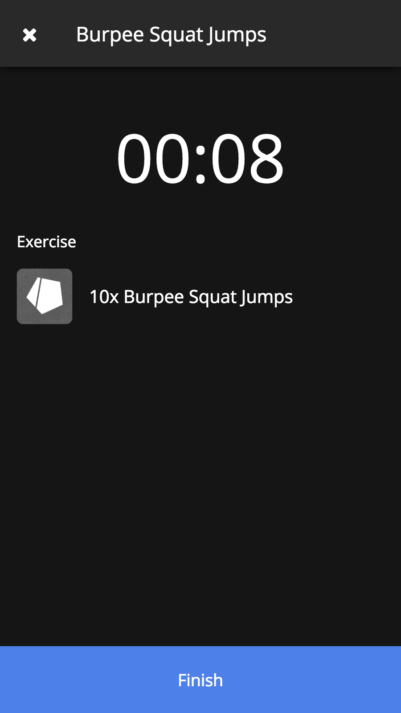
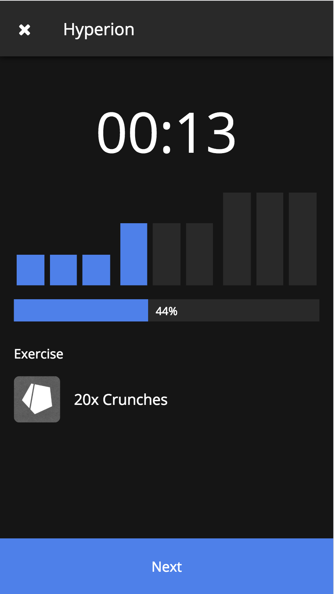
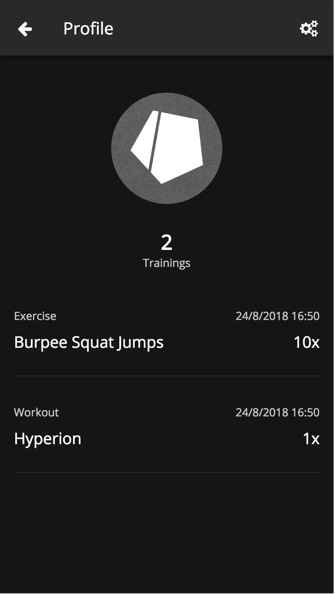
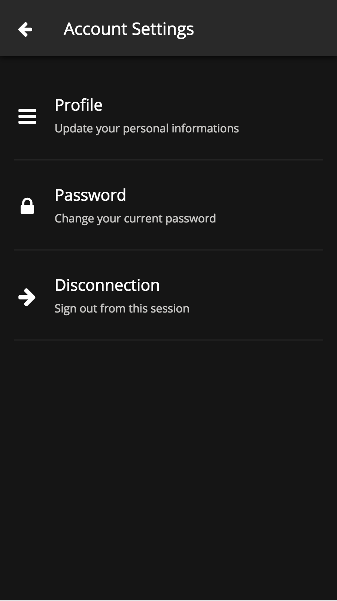

# Fitletics

## Description
Fitletics is a calisthenics workout web app designed for mobiles browsers only !

## Screenshots

<center>








</center>

## Demo
The current live demo is hosted at https://nodehub.freeboxos.fr:4000

## Configuration
Before running the app, you must update the configuration file located in the **/config** directory.

```
const Sequelize = require('sequelize');

module.exports = {
  // Running ip and port
  server: {
    host: '127.0.0.1',
    port: 4000
  },
  // Database connection options
  database: {
    host: '127.0.0.1',
    port: 3306,
    dialect: 'mysql',
    operatorsAliases: Sequelize.Op,
    database: 'database',
    username: 'username',
    password: 'password'
  },
  // Reset database tables on server startup
  models: {
    sync: false
  },
  // Nodemailer options
  mail: {
    service: 'provider',
    auth: {
      user: 'user@domain.ext',
      pass: 'password'
    }
  },
  // Json Web Token secret encryption key
  jsonwebtoken: {
    secret: 'aVerySecretEncryptionKey'
  }
};

```


## Setup

### MacOS and Linux

Create the virtual host.

```
$> docker-machine create --driver virtualbox fitletics

$> docker-machine start fitletics

$> eval $(docker-machine env fitletics)
```

Build the server container.

```
$> docker build -t fitletics .
```

Run the MySQL or the PostgreSQL database. Note that the version of MySQL must be <= 5.6 otherwise Sequelize will fail on authentication.

```
$> docker run -d -p 3306:3306 -e "MYSQL_ROOT_PASSWORD=__root_password__" -e "MYSQL_DATABASE=fitletics" -e "MYSQL_USER=__user__" -e "MYSQL_PASSWORD=__password__" mysql:5.6

# or

$> docker run -d -p 5432:5432 -e "POSTGRES_PASSWORD=__password__" -e "POSTGRES_USER=__user__" -e "POSTGRES_DB=fitletics" postgres
```

Run the server.

```
$> docker run -d -p 4000:4000 fitletics
```

Enjoy !

### Raspberry Pi 3

Replace the Dockerfile FROM command.

```
FROM node:alpine

# by

FROM resin/raspberry-pi-alpine-node
```

Build the server containers.

```
$> docker build -t fitletics .
```

Run the PostgreSQL database.

```
$> docker run -d -p 5432:5432 -e "POSTGRES_PASSWORD=__password__" -e "POSTGRES_USER=__user__" -e "POSTGRES_DB=fitletics" tobi312/rpi-postgresql
```

Run the server.

```
$> docker run -d -p 4000:4000 fitletics
```

Enjoy !
