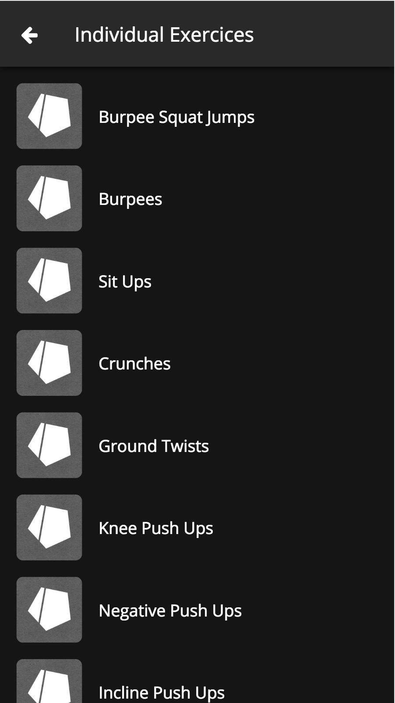

# Fitletics

## Description
Fitletics is a calisthenics workout web app designed for mobiles browsers only !

## Screenshots

<p align="center">





</p>

## Demo
The current live demo is hosted at http://82.67.201.36:4000

## Configuration
Before running the app, you must update/create the configuration file located at **/config/index.js** like so.

```
const Sequelize = require('sequelize');

module.exports = {
  // Running ip and port
  server: {
    host: '',
    port: 0000
  },
  // Database connection options
  database: {
    host: '',
    port: 0000,
    dialect: '',
    operatorsAliases: Sequelize.Op,
    database: '',
    username: '',
    password: ''
  },
  // Reset database tables on server startup
  // Must be set to true for the first run to initialize database
  models: {
    sync: false
  },
  // Nodemailer options
  mail: {
    service: '',
    auth: {
      user: '',
      pass: ''
    }
  },
  // Json Web Token secret encryption key
  jsonwebtoken: {
    secret: ''
  }
};

```

## Unit tests

API unit tests are built using Mocha, Chai and Chai-http. To run all tests at once run the following command in your terminal.

```
npm test
```

## Setup

### MacOS and Linux

Create the virtual host.

```
$> docker-machine create --driver virtualbox my-docker-machine

$> docker-machine start my-docker-machine

$> eval $(docker-machine env my-docker-machine)
```

Build the server container.

```
$> docker build -t fitletics-server .
```

Run the MySQL or the PostgreSQL database. Note that the version of MySQL must be <= 5.6 otherwise Sequelize will fail on authentication.

```
$> docker run -d -p 3306:3306 -e "MYSQL_ROOT_PASSWORD=__root_password__" -e "MYSQL_DATABASE=fitletics" -e "MYSQL_USER=__user__" -e "MYSQL_PASSWORD=__password__" mysql:5.6

# or

$> docker run -d -p 5432:5432 -e "POSTGRES_PASSWORD=__password__" -e "POSTGRES_USER=__user__" -e "POSTGRES_DB=fitletics" postgres
```

Run the server.

```
$> docker run -d -p 4000:4000 fitletics-server
```

Enjoy !

### Raspberry Pi 3

Replace the Dockerfile FROM command.

```
FROM node:alpine

# by

FROM resin/raspberry-pi-alpine-node
```

Build the server containers.

```
$> docker build -t fitletics-server .
```

Run the PostgreSQL database.

```
$> docker run -d -p 5432:5432 -e "POSTGRES_PASSWORD=__password__" -e "POSTGRES_USER=__user__" -e "POSTGRES_DB=fitletics" tobi312/rpi-postgresql
```

Run the server.

```
$> docker run -d -p 4000:4000 fitletics-server
```

Enjoy !
